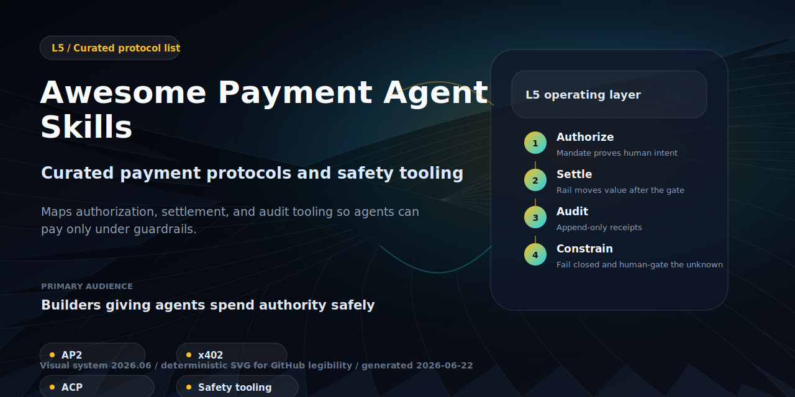
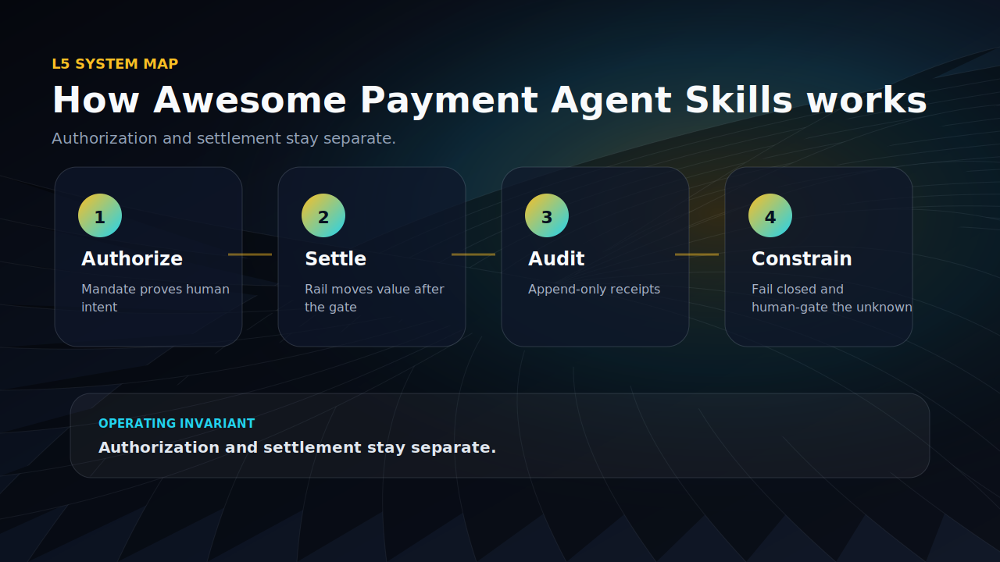
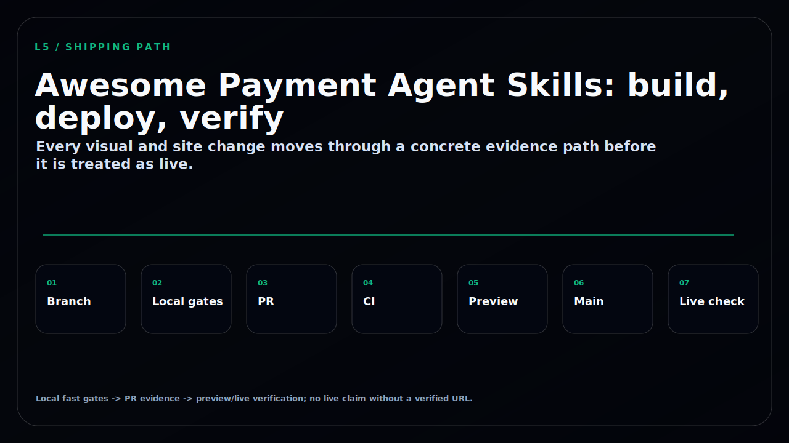

<!-- GITHUB_VISUALS_START -->

  

<strong>How this repo works</strong>

  

<strong>Build, deploy, verify path</strong>

  

<!-- GITHUB_VISUALS_END -->

# Awesome Payment Agent Skills 

> A curated list of protocols, MCP servers, libraries, SDKs, and playbooks for **giving AI agents the power to pay — safely.** Authorization, settlement, and the guardrails that sit between an agent and your money.

The thesis in one line: an agent that can spend is an agent that can be exploited — so the interesting work isn't moving money, it's *proving the human authorized it* and *gating every transaction before a rail settles*. Mandate first, settle second, audit always.

This list is the **L5 (Payments)** companion to [awesome-agentic-income](https://github.com/frankxai/awesome-agentic-income) (L4 — how agents *earn*). Income generates the stream; payments authorize and settle it. The two compose.

## Contents

- [The Shape of an Agentic Payment](#the-shape-of-an-agentic-payment)
- [Protocols & Standards](#protocols--standards)
- [Payment MCP Servers](#payment-mcp-servers)
- [Authorization & Mandate Libraries](#authorization--mandate-libraries)
- [Agentic Commerce SDKs](#agentic-commerce-sdks)
- [Safety & Audit Tooling](#safety--audit-tooling)
- [Playbooks & Principles](#playbooks--principles)
- [Contributing](#contributing)

## The Shape of an Agentic Payment

Three questions, answered by three different layers — never collapse them:

1. **Was this authorized?** → a signed *mandate* (AP2). Cryptographic proof the human approved *this* purchase, with caps and a time window. Does not move money.
2. **How does the money move?** → a *settlement rail* (x402 for onchain USDC, ACP for tokenized card). The mandate is checked first; the rail moves value second.
3. **Can we prove what happened?** → an append-only *audit trail* + a human-approval gate for anything outside the mandate's bounds.

Authorization and settlement are separable concerns. AP2 answers #1; x402 and ACP answer #2; the governance layer (the [payment-intelligence-system](https://github.com/frankxai/payment-intelligence-system) MCP) enforces #1 *before* #2 and records #3.

## Protocols & Standards

The open standards for agent-initiated payments. These are specs to adopt, not servers to reimplement.

| Name | Owner | Role | License | Link |
|---|---|---|---|---|
| **AP2** (Agent Payments Protocol) | Google + 60 partners (Mastercard, Amex, PayPal, Adyen, Coinbase) | **Authorization** — cryptographically signed mandates (Verifiable Credentials) prove a user authorized a specific purchase. Payment-method agnostic; does not move money. v0.2.0 (Apr 2026). | Apache 2.0 | [ap2-protocol.org](https://ap2-protocol.org/) · [GitHub](https://github.com/google-agentic-commerce/AP2) |
| **x402** | x402 Foundation (Coinbase + Cloudflare); members incl. Google, Visa, AWS, Circle, Anthropic, Vercel | **Settlement rail** — revives HTTP `402 Payment Required`; the agent signs a USDC stablecoin transaction onchain (Base / Solana). Account-less, zero protocol fee. | Apache 2.0 | [x402.org](https://www.x402.org/) · [foundation announcement](https://www.coinbase.com/blog/coinbase-and-cloudflare-will-launch-x402-foundation) |
| **ACP** (Agentic Commerce Protocol) | OpenAI + Stripe | **Checkout rail** — a Shared Payment Token lets an agent pay without seeing card credentials; OAuth 2.0 delegated auth. Powers ChatGPT Instant Checkout. Beta. | Apache 2.0 | [GitHub](https://github.com/agentic-commerce-protocol/agentic-commerce-protocol) · [Stripe Docs](https://docs.stripe.com/agentic-commerce/acp) |
| **Visa Intelligent Commerce** | Visa | Network-side agent enablement — tokenized credentials bound to a specific agent, user authentication, spend controls, and dispute signals. | Proprietary (network) | [developer.visa.com](https://developer.visa.com/capabilities/visa-intelligent-commerce) |
| **Mastercard Agent Pay** | Mastercard | Network-side agent enablement — Agentic Tokens (scoped, de-tokenized by MDES so the card number never reaches the agent) + agent-aware identity/checkout. | Proprietary (network) | [mastercard.com](https://www.mastercard.com/global/en/news-and-trends/press/2025/april/mastercard-unveils-agent-pay-pioneering-agentic-payments-technology-to-power-commerce-in-the-age-of-ai.html) |

> **How they compose:** AP2 (authorization) sits above x402 *or* ACP (settlement). AP2 + x402 already integrate. Visa and Mastercard plug their networks into the same shape via tokenized, agent-scoped credentials. Pick one authorization layer + one rail; never let an agent settle without a mandate.

## Payment MCP Servers

MCP servers that give an agent payment capability — or, more importantly, *govern* it.

- [payment-intelligence-system](https://github.com/frankxai/payment-intelligence-system) — a **governance control surface** (not just a payment connector). A small, fail-closed Payments MCP exposing `verify_mandate`, `check_spend_cap`, `record_audit_entry`, `require_human_approval` — verifies the AP2 mandate and enforces spend caps *before* any rail settles. ⚠️ v0.1 scaffold, unaudited, not for live funds. The reason this list exists: a payment MCP should *gate*, not just *spend*.
- [`agentic-payments` MCP](https://github.com/google-agentic-commerce/AP2/issues/96) — AP2 reference implementation with Visa TAP support, exposed as an MCP server (`npx agentic-payments mcp`) giving an assistant a set of payment tools backed by Ed25519-signed mandates. Tracks the AP2 spec. (See [Authorization & Mandate Libraries](#authorization--mandate-libraries) for the library form.)
- [Stripe MCP](https://docs.stripe.com/mcp) — Stripe's official MCP server; pairs with ACP for tokenized-card checkout flows.

> **The build-vs-adopt rule:** build a payment MCP only when it's a *control surface* over money — small, testable, fail-closed. Everything else, adopt a vendor server. A governance MCP that rejects on ambiguity is worth more than one that can spend.

## Authorization & Mandate Libraries

The cryptographic core — signing, verifying, and revoking what an agent is allowed to spend.

- [AP2 reference implementations](https://github.com/google-agentic-commerce/AP2) — Python reference + community ports. Mandates are Ed25519-signed Verifiable Credentials carrying spend caps, time windows, and merchant restrictions; verification runs against the signature, not custom infra.
- [`agentic-payments`](https://github.com/google-agentic-commerce/AP2/issues/96) — production-oriented AP2 implementation (Intent + Cart Mandates, instant revocation, Visa TAP). Verifies a transaction against mandate constraints before it settles.
- [Cart / Intent Mandates spec](https://ap2-protocol.org/) — the mandate taxonomy: an *Intent Mandate* ("you may spend ≤ $X/week at merchant Y") vs a *Cart Mandate* (signed proof of exactly what was approved — dispute-grade evidence).

## Agentic Commerce SDKs

Build agent-side and merchant-side payment flows.

- [Stripe Agentic Commerce (ACP)](https://docs.stripe.com/agentic-commerce/acp) — merchant + agent SDK for Shared Payment Token checkout; the production path behind ChatGPT Instant Checkout.
- [Coinbase AgentKit](https://github.com/coinbase/agentkit) — "every AI agent deserves a wallet": framework-agnostic toolkit to give an agent an onchain wallet for x402-style USDC settlement. [Docs](https://docs.cdp.coinbase.com/agent-kit/welcome) · [Node](https://github.com/coinbase/cdp-agentkit-nodejs).
- [x402 ecosystem & facilitators](https://www.x402.org/ecosystem) — the registry of x402 facilitators (the services that verify and settle the `402` USDC payment) and middleware for adding `402` to any API/endpoint.
- [Visa Intelligent Commerce for Agents](https://developer.visa.com/use-cases/visa-intelligent-commerce-for-agents) — Visa's developer use-case docs for agent-scoped tokenized credentials.

## Safety & Audit Tooling

Spend authority is a security surface. These are the patterns that keep an agent from being the weakest link.

- [PROTECTION-LAYERS.md](https://github.com/frankxai/agentic-ops-hub/blob/main/docs/PROTECTION-LAYERS.md) — defense-in-depth for humans, agents, and wealth: where mandate verification, spend caps, human-approval gates, and audit trails sit in the stack.
- [RED-BLUE-CHARTER.md](https://github.com/frankxai/agentic-ops-hub/blob/main/docs/RED-BLUE-CHARTER.md) — what red team attacks on a payment path (mandate forgery, cap bypass, replayed settlement, prompt-injected spend) and what blue team must hold before anything touches real funds.
- [starlight-evals](https://github.com/frankxai/starlight-evals) — whole-system eval harness with an Income & Payments Safety lane; the red/blue loop that gates a payment path before it goes live.
- **Fail-closed discipline** — a payment control surface must reject on ambiguity. Never let an unverified mandate, an unknown merchant, or a missing audit write silently pass. (See the Payments MCP trust-boundary note in [MCP-STRATEGY.md](https://github.com/frankxai/agentic-ops-hub/blob/main/docs/MCP-STRATEGY.md).)

## Playbooks & Principles

**How to safely give an agent spend authority (the short version):**

1. **Mandate before money.** Issue a scoped AP2 Intent Mandate (cap + time window + merchant allow-list). The agent never spends outside it. Verify the signature on every transaction.
2. **Separate authorization from settlement.** One layer proves "yes, allowed" (AP2); a different layer moves value (x402 / ACP). A compromised rail can't manufacture authorization.
3. **Gate the unknown.** Anything outside the mandate's bounds — new merchant, over cap, unusual amount — routes to a human-approval gate, not an auto-approve.
4. **Audit append-only.** Every authorization, settlement, and rejection lands in an immutable log. If you can't prove what happened, the agent shouldn't have spent.
5. **Fail closed.** On any ambiguity — missing signature, expired mandate, unreachable audit sink — reject. A blocked legitimate payment is recoverable; an unauthorized settlement is not.
6. **Red-team the spend path before live funds.** Treat the payment surface like any other attack surface: forge mandates, replay settlements, inject prompts that ask for spend — and confirm blue team holds.

**The five principles:** authorization ≠ settlement · scoped mandates over standing access · human gate for the unknown · audit everything · fail closed.

## Contributing

PRs welcome — add a protocol, server, library, SDK, or safety tool. Keep links live, keep claims verifiable, and say in one clause why an entry earns a reader's time. See the [contribution guidelines](CONTRIBUTING.md). One entry per PR; match the format of the section you're adding to. Payment claims especially: link the official spec/repo, and never overstate maturity (beta is beta).

## License

 — released under [CC0](LICENSE). No rights reserved.
